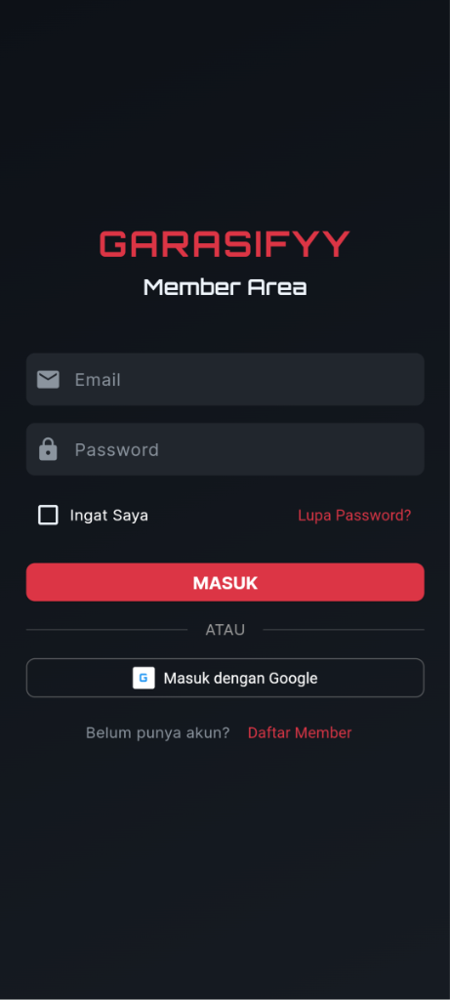

<div align="center">

# 🚗 Garasiffy Mobile

### Premium Car Modification Platform

[](https://flutter.dev)
[](https://dart.dev)
[](https://firebase.google.com)
[](LICENSE)

<p align="center">
  <strong>Digital Workshop Management System untuk Bengkel Modifikasi</strong>
</p>

<p align="center">
  <em>One Stop Modification - Engine • Interior • Exterior • Audio</em>
</p>

---

## 📥 Download APK

<a href="https://github.com/tech0608/Garasiffy_project/releases/latest">
  
</a>

**[⬇️ Download APK Terbaru](https://github.com/tech0608/Garasiffy_project/releases/latest/download/app-release.apk)**

> 💡 **Catatan:** Aktifkan "Install dari sumber tidak dikenal" di pengaturan HP Android Anda untuk menginstall APK.

---

</div>

## 📋 Tentang Garasiffy

**Garasiffy** adalah startup bengkel modifikasi kendaraan dengan konsep **"One Stop Modification"**. Aplikasi mobile ini membantu mendigitalisasi proses manajemen bengkel untuk meningkatkan efisiensi dan kepuasan konsumen.

### 🎯 Masalah yang Dipecahkan

| Masalah | Solusi |
|---------|--------|
| 📊 Antrian tidak terstruktur | Sistem queue management real-time |
| 🔍 Transparansi terbatas | Progress tracking dengan persentase |
| 📱 Komunikasi kurang efisien | Notifikasi otomatis & update status |
| ⏱️ Estimasi tidak akurat | Kalkulasi estimasi berdasarkan workload |

---

## ✨ Fitur Utama

<table>
<tr>
<td width="50%">

### 📅 Booking System
- Browse layanan modifikasi
- Booking online dengan kalender
- Estimasi waktu otomatis
- Konfirmasi booking instan

</td>
<td width="50%">

### 👥 User Management
- Registrasi & login aman
- Profile management
- Riwayat modifikasi
- Data kendaraan tersimpan

</td>
</tr>
<tr>
<td width="50%">

### 📊 Progress Tracking
- Update persentase real-time
- Timeline pengerjaan
- Breakdown task detail
- Foto progress (opsional)

</td>
<td width="50%">

### 🔔 Notification System
- Push notification status
- Reminder booking
- Update selesai
- Promo & info bengkel

</td>
</tr>
</table>

---

## 📱 Screenshot Aplikasi

| Login | Dashboard | Services |
|:---:|:---:|:---:|
|  |  |  |

| Detail Layanan | Booking | Profile |
|:---:|:---:|:---:|
|  |  |  |

---

## 🛠️ Tech Stack

```
┌─────────────────────────────────────────────────────────┐
│  Frontend                                                │
│  ├── Flutter 3.0+                                       │
│  ├── Dart 3.0+                                          │
│  └── Provider (State Management)                        │
├─────────────────────────────────────────────────────────┤
│  Backend                                                 │
│  ├── Firebase Authentication                            │
│  ├── Cloud Firestore                                    │
│  └── Firebase Cloud Messaging                           │
├─────────────────────────────────────────────────────────┤
│  Architecture                                            │
│  └── MVVM Design Pattern                                │
└─────────────────────────────────────────────────────────┘
```

---

## 🚀 Quick Start

### Prerequisites
- Flutter SDK v3.0+
- Android Studio / VS Code
- Java JDK 11+

### Installation

```bash
# 1. Clone repository
git clone https://github.com/tech0608/Garasiffy_project.git
cd Garasiffy_project

# 2. Install dependencies
flutter pub get

# 3. Run aplikasi
flutter run

# 4. Build APK (opsional)
flutter build apk --release
```

### 📦 Output APK
Setelah build berhasil, APK tersedia di:
```
build/app/outputs/flutter-apk/app-release.apk
```

---

## 🔧 Troubleshooting

<details>
<summary><b>❌ Build gagal karena path dengan spasi</b></summary>

Jika username Windows Anda mengandung spasi (contoh: `C:\Users\John Doe`), pindahkan project ke lokasi tanpa spasi:

```bash
# Pindahkan ke C:\dev\
Copy-Item -Recurse "path\ke\project" "C:\dev\garasifyy_mobile"
cd C:\dev\garasifyy_mobile
flutter clean && flutter build apk --release
```
</details>

<details>
<summary><b>❌ Gradle connection error</b></summary>

```bash
# Stop Gradle daemon
cd android
./gradlew --stop

# Clean dan rebuild
flutter clean
flutter pub get
flutter build apk --release
```
</details>

<details>
<summary><b>❌ Firebase configuration error</b></summary>

Pastikan file `google-services.json` ada di `android/app/`. Download dari [Firebase Console](https://console.firebase.google.com) jika belum ada.
</details>

---

## 📂 Project Structure

```
garasifyy_mobile/
├── lib/
│   ├── models/          # Data models
│   ├── screens/         # UI screens
│   │   ├── auth/        # Login & register
│   │   ├── booking/     # Booking flow
│   │   ├── dashboard/   # Main dashboard
│   │   ├── profile/     # User profile
│   │   └── services/    # Service catalog
│   ├── services/        # Firebase services
│   ├── providers/       # State management
│   ├── router/          # App routing
│   └── main.dart        # Entry point
├── android/             # Android config
├── assets/              # Images & fonts
└── pubspec.yaml         # Dependencies
```

---

## 👨‍💻 Developer

<table>
<tr>
<td align="center">
<strong>Luthfy Arief</strong><br>
<a href="https://github.com/tech0608">@tech0608</a><br>
<em>Universitas Teknologi Bandung (UTB)</em>
</td>
</tr>
</table>

---

## 📄 License

Project ini dibuat untuk keperluan edukasi sebagai tugas **UAS Mobile Programming 2**.

---

<div align="center">

**© 2026 Garasiffy - Premium Car Modification Platform**

<sub>Made with ❤️ using Flutter</sub>

</div>
