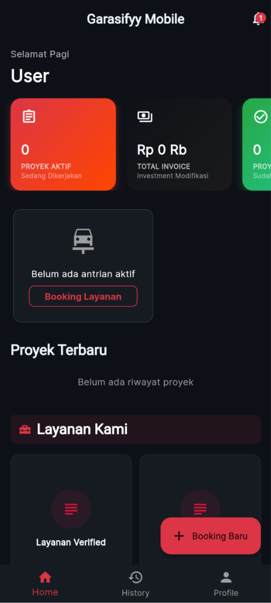
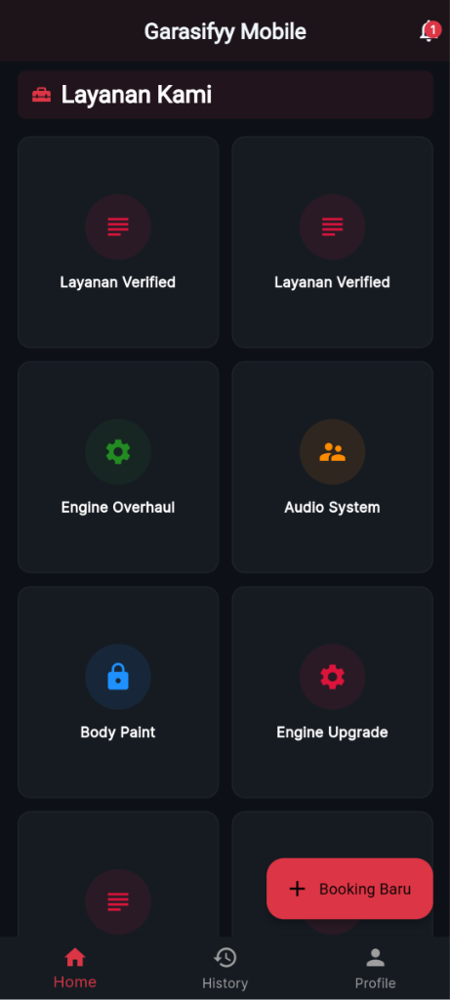
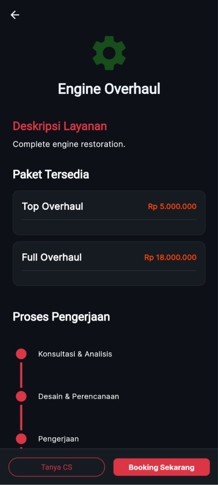
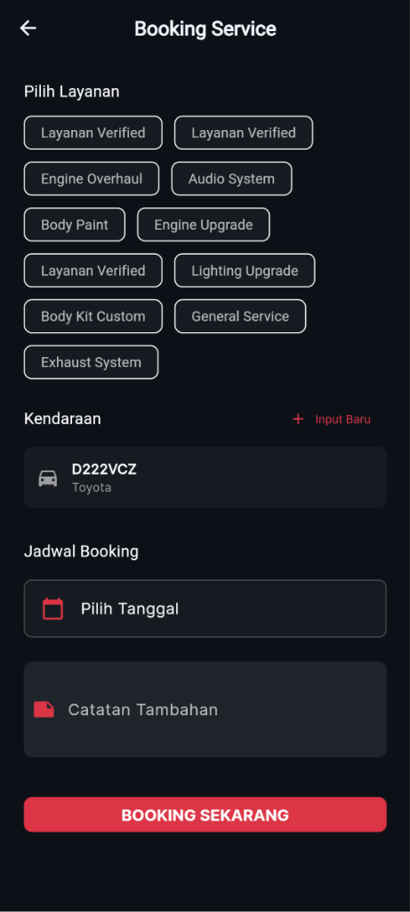

# Garasiffy - Digital Workshop Management System

## 📋 Latar Belakang Proyek

### Tentang Garasiffy
**Garasiffy** adalah sebuah startup yang bergerak di bidang layanan bengkel modifikasi kendaraan dengan konsep **"One Stop Modification"**. Bengkel ini menyediakan layanan modifikasi komprehensif yang meliputi:

- **Engine** - Modifikasi mesin dan performa kendaraan
- **Interior** - Penyesuaian dan peningkatan bagian dalam kendaraan
- **Exterior** - Modifikasi tampilan luar kendaraan
- **Audio** - Instalasi dan peningkatan sistem audio kendaraan

### Masalah yang Dihadapi
Sebelum adanya sistem digital, Garasiffy menghadapi beberapa tantangan dalam mengelola operasional bengkel:

- 📊 **Pengelolaan antrian yang tidak terstruktur** - Kesulitan dalam melacak kendaraan mana yang sedang dikerjakan dan urutan pengerjaan
- 🔍 **Transparansi proses kerja yang terbatas** - Konsumen tidak dapat memantau progress pengerjaan kendaraan mereka secara real-time
- 📱 **Komunikasi yang kurang efisien** - Antara konsumen dan pengelola bengkel memerlukan sistem yang lebih baik
- ⏱️ **Estimasi waktu yang tidak akurat** - Sulit memberikan informasi kepastian kapan pekerjaan akan selesai
- 📈 **Manajemen sumber daya yang tidak optimal** - Kesulitan dalam mengalokasikan mekanik dan peralatan dengan efisien

### Solusi: Aplikasi Garasiffy Mobile
Proyek ini merupakan konversi dari versi web sebelumnya ([Garasifyy_UTS_Web1](https://github.com/tech0608/Garasifyy_UTS_Web1)) ke platform mobile yang lebih accessible dan user-friendly.

#### Tujuan Aplikasi:

1. **Untuk Konsumen:**
   - ✅ Memudahkan pemesanan dan booking modifikasi kendaraan
   - ✅ Otomatis masuk ke dalam antrian setelah booking
   - ✅ Menerima estimasi waktu kapan dapat masuk ke bengkel
   - ✅ Memantau progress pengerjaan secara real-time (sudah berapa persen dikerjakan)
   - ✅ Menerima notifikasi/update tentang perkembangan pekerjaan
   - ✅ Komunikasi langsung dengan bengkel

---

## 🎯 Fitur Utama
Aplikasi Garasiffy dirancang dengan fitur-fitur berikut:

### 📅 Booking System (Sistem Pemesanan)
- **Browse Services** - Konsumen dapat melihat daftar layanan modifikasi yang tersedia
- **Book Modification** - Konsumen dapat memilih jenis modifikasi yang diinginkan
- **Automatic Queue Entry** - Setelah booking selesai, konsumen otomatis masuk ke dalam antrian
- **Time Estimation** - Sistem memberikan estimasi tanggal dan waktu kapan kendaraan dapat masuk ke bengkel berdasarkan:
  - Antrian saat ini
  - Kapasitas mekanik
  - Durasi pengerjaan untuk jenis modifikasi yang dipilih
- **Booking Confirmation** - Konfirmasi booking dengan detail lengkap

### User Management
- Registrasi dan login untuk konsumen
- Profile management
- History riwayat modifikasi
- Data kendaraan konsumen

### Queue Management (Manajemen Antrian)
- Daftar antrian kendaraan yang real-time
- Status pengerjaan kendaraan (menunggu/sedang dikerjakan/selesai)
- Prioritas antrian
- Estimasi waktu penyelesaian yang dinamis

### Progress Tracking (Pemantauan Progress)
- Update persentase progres pengerjaan
- Breakdown task/pekerjaan yang dilakukan
- Timeline pengerjaan
- Notifikasi otomatis kepada konsumen saat status berubah

### Notification System
- Notifikasi push untuk update status kendaraan
- Notifikasi reminder booking approach (kendaraan akan masuk bengkel)
- Email/SMS notification (opsional)

---

## 🛠️ Tech Stack
*Teknologi yang digunakan:*
- **Framework:** Flutter (Mobile)
- **Language:** Dart
- **Backend:** Firebase (Firestore, Auth, Cloud Functions)
- **State Management:** Provider
- **Architecture:** MVVM Design Pattern

## 📦 Konversi dari Web Version
Proyek ini mengonversi aplikasi web asli dengan meningkatkan:
- User experience untuk mobile devices
- Performa dan kecepatan akses
- Kemudahan penggunaan real-time di lapangan
- Integration dengan notification system
- Fitur booking yang seamless dan user-friendly

## 📱 Platform Target
- **Android**

## 🚀 Status Proyek
*Completed (v1.0.0)*

## 👥 Tim Pengembang
- **Developer:** @tech0608

## �️ Galeri Aplikasi
*(Tambahkan screenshot aplikasi di sini)*

| Home Dashboard | Layanan & Services | Detail Layanan |
|:---:|:---:|:---:|
|  |  |  |

| Booking Form | Profile User |
|:---:|:---:|
|  |  |

## 💻 Cara Instalasi & Menjalankan

Ikuti langkah berikut untuk menjalankan proyek di komputer lokal:

### Prerequisites:
- Flutter SDK (v3.0+)
- Android Studio / VS Code
- Java JDK (v11+)

### Langkah Instalasi:

1. **Clone Repository**
   ```bash
   git clone https://github.com/tech0608/garasifyy_mobile.git
   cd garasifyy_mobile
   ```

2. **Install Dependencies**
   ```bash
   flutter pub get
   ```

3. **Konfigurasi Firebase**
   - Pastikan file `google-services.json` sudah ada di folder `android/app/`.
   - Jika belum, download dari Firebase Console proyek Anda.

4. **Jalankan Aplikasi**
   Pastikan emulator sudah jalan atau HP terhubung.
   ```bash
   # Untuk Mobile (Android/iOS)
   flutter run

   # Untuk Web (Chrome)
   flutter run -d chrome
   ```

5. **Build APK (Untuk Android)**
   ```bash
   flutter build apk --release
   ```

### 📱 Cara Menjalankan Versi Web (Mode Mobile)

Jika Anda menjalankan aplikasi di browser (Chrome) dan ingin melihat tampilan mobile:

1. Jalankan perintah `flutter run -d chrome`.
2. Setelah browser terbuka, klik kanan pada halaman dan pilih **Inspect** (atau tekan `F12` / `Ctrl+Shift+I`).
3. Klik icon **Toggle Device Toolbar** (icon berbentuk HP/Tablet) di pojok kiri atas panel Inspect (atau tekan `Ctrl+Shift+M`).
4. Pilih tipe device pada dropdown di bagian atas layar (contoh: **iPhone 12 Pro** atau **Pixel 5**).
5. **Refresh halaman** (`F5`) agar tampilan menyesuaikan ukuran layar mobile dengan sempurna.

### 📸 Tips Mengambil Screenshot Presisi (Tanpa Crop Manual)

Agar hasil screenshot **rapi, pas seukuran HP, dan tidak terpotong manual**:

1. Pastikan Anda sudah dalam **Mode Mobile** (Device Toolbar aktif).
2. Di bagian atas tampilan mobile (toolbar abu-abu), klik **tanda titik tiga (⋮)** di sebelah kanan angka persentase zoom.
3. Pilih **"Capture screenshot"** (untuk area yang terlihat) atau **"Capture full size screenshot"** (untuk seluruh halaman panjang ke bawah).
4. Chrome akan otomatis mendownload file PNG dengan ukuran yang **presisi sesuai device** tanpa ada bagian browser yang ikut terbawa.

> **Note:** Zoom level browser sebaiknya 100% agar layout terlihat akurat.

## �📄 Lisensi
This project is created for educational purposes as part of UAS Mobile Programing 2 assignment.

Developed by **Luthfy Arief**
**Universitas Teknologi Bandung (UTB)**

---

© 2026 Garasify - Premium Car Modification Platform. All rights reserved.

**Catatan:** Proyek ini fokus pada digitalisasi proses manajemen bengkel modifikasi untuk meningkatkan efisiensi operasional dan kepuasan konsumen melalui transparansi, komunikasi yang lebih baik, serta sistem booking dan antrian yang terstruktur.
